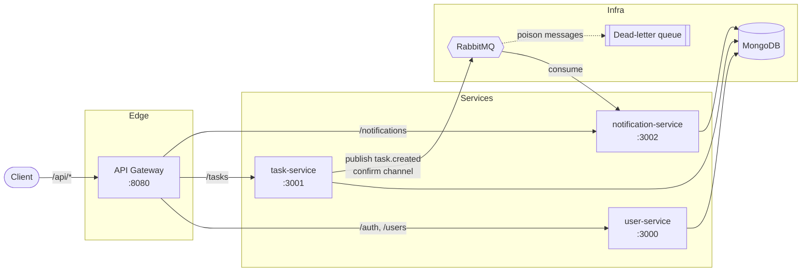

# Hermes

An event-driven microservices platform for creating tasks and delivering notifications, built with Node.js, Express, MongoDB, and RabbitMQ. Hermes is a small system that demonstrates production-grade practices end to end: an API gateway, JWT auth, resilient messaging with a dead-letter queue, health/readiness probes, structured logging with correlation IDs, Prometheus metrics, containerised delivery, and automated tests.

---

## Architecture



**Flow:** a client authenticates through the gateway against `user-service` and receives a JWT. It then creates a task via `task-service`, which persists it and publishes a `task.created` event to RabbitMQ (waiting for a broker confirmation). `notification-service` consumes that event, stores a notification in MongoDB, and exposes it through an authenticated endpoint. A correlation ID is generated at the gateway and threaded through every service and the message headers so a single request can be traced across the whole system.

---

## Services

| Service                | Port | Responsibility                                                              |
| ---------------------- | ---- | --------------------------------------------------------------------------- |
| `gateway`              | 8080 | Single entry point; routes `/api/*`, rate-limits, propagates correlation ID |
| `user-service`         | 3000 | Registration, login (bcrypt + JWT), user profiles                           |
| `task-service`         | 3001 | Task CRUD; publishes `task.created` events                                  |
| `notification-service` | 3002 | Consumes task events, persists and serves notifications                     |

Supporting infrastructure: **MongoDB** (one database per service) and **RabbitMQ** (durable exchange + dead-letter queue). Optional **Prometheus** + **Grafana** for metrics.

---

## Quick start

Requirements: Docker + Docker Compose.

```bash
cp .env.example .env          # set a strong JWT_SECRET
make up                       # build images and start the whole stack
# or, with metrics:
make observability            # also starts Prometheus (:9090) and Grafana (:3003)
```

The gateway is then available at `http://localhost:8080`. Compose gates every service on its dependencies being **healthy**, so the stack comes up in the right order without race conditions.

### Try it end to end

```bash
# 1. Register (through the gateway) and capture the token
TOKEN=$(curl -s -X POST http://localhost:8080/api/auth/register \
  -H 'Content-Type: application/json' \
  -d '{"name":"Ada","email":"ada@example.com","password":"supersecret1"}' \
  | node -pe 'JSON.parse(require("fs").readFileSync(0)).token')

# 2. Create a task (emits a task.created event)
curl -s -X POST http://localhost:8080/api/tasks \
  -H "Authorization: Bearer $TOKEN" -H 'Content-Type: application/json' \
  -d '{"title":"Write the docs","description":"then ship"}'

# 3. Read the notification produced by the event
curl -s http://localhost:8080/api/notifications -H "Authorization: Bearer $TOKEN"
```

---

## API

All API routes are reachable through the gateway under `/api`. Each service also serves interactive docs at `/docs` and a raw spec at `/openapi.json`.

### Auth (`user-service`)

| Method | Path             | Auth | Body                        |
| ------ | ---------------- | ---- | --------------------------- |
| POST   | `/auth/register` | —    | `{ name, email, password }` |
| POST   | `/auth/login`    | —    | `{ email, password }`       |

Both return `{ user, token }`.

### Users (`user-service`)

| Method | Path         | Auth   | Notes                      |
| ------ | ------------ | ------ | -------------------------- |
| GET    | `/users`     | Bearer | Paginated (`page`,`limit`) |
| GET    | `/users/me`  | Bearer | The authenticated user     |
| GET    | `/users/:id` | Bearer |                            |

### Tasks (`task-service`)

| Method | Path     | Auth   | Notes                                            |
| ------ | -------- | ------ | ------------------------------------------------ |
| POST   | `/tasks` | Bearer | `{ title, description? }`; owner = token subject |
| GET    | `/tasks` | Bearer | Paginated; optional `status` filter              |

### Notifications (`notification-service`)

| Method | Path                      | Auth   | Notes                        |
| ------ | ------------------------- | ------ | ---------------------------- |
| GET    | `/notifications`          | Bearer | Paginated; optional `unread` |
| PATCH  | `/notifications/:id/read` | Bearer | Mark one as read             |

### Operational endpoints (every service)

| Path       | Purpose                                             |
| ---------- | --------------------------------------------------- |
| `/health`  | Liveness (process is up)                            |
| `/ready`   | Readiness (Mongo / RabbitMQ reachable) — 200 or 503 |
| `/metrics` | Prometheus metrics                                  |

---

## Design decisions

**API gateway.** A single edge service routes by path prefix, applies coarse rate-limiting, and mints a correlation ID that is forwarded downstream (`x-request-id`) so logs across services can be stitched into one trace. It streams request bodies through untouched; each service parses and validates its own input.

**Authentication.** Passwords are hashed with bcrypt and never leave the database (the model strips the hash from every JSON response). Services issue and verify stateless JWTs. Ownership is always derived from the token subject — a task's `userId` comes from the JWT, never from the request body — so a caller cannot create or read another user's data.

**Resilient messaging.** The publisher uses a **confirm channel**, so an HTTP request only succeeds once the broker has durably accepted the event. The topology is a durable direct exchange bound to a durable queue, and that queue is configured with a **dead-letter exchange**. The consumer sets a prefetch limit and, on a malformed or invalid message, `nack`s it without requeue — routing the poison message to the dead-letter queue instead of crash-looping. Both producer and consumer declare the full topology, so either can start first, and both reconnect automatically if the broker restarts.

**Health-gated startup.** Every container defines a `HEALTHCHECK`, and Compose uses `depends_on: { condition: service_healthy }` so services start only once their dependencies are actually ready — not merely started.

**Observability.** Structured JSON logs (pino) in production, pretty logs in development, with a per-request ID. Prometheus metrics (default process metrics plus a request-duration histogram) are exposed on `/metrics`, with an optional Prometheus + Grafana stack behind a Compose profile.

**Graceful shutdown.** On `SIGTERM`/`SIGINT` each service stops accepting connections and closes its Mongo and RabbitMQ connections before exiting, with a hard timeout as a backstop.

**Containers.** Multi-stage builds produce lean runtime images that run as the non-root `node` user.

---

## Development

Each service is an independent Node package.

```bash
make install      # install deps for every service
make test         # run every service's test suite
make lint         # ESLint across the repo
make down         # stop stack and remove volumes
```

Run a single service locally against its own `.env` (see each service's `.env.example`):

```bash
cd user-service && cp .env.example .env && npm install && npm run dev
```

### Testing

- `user-service`, `task-service`, `notification-service` use **Jest + supertest**, with **`mongodb-memory-server`** spinning up a real in-memory MongoDB for integration tests (no external database required).
- `gateway` uses Node's built-in test runner (`node --test`) with a fake upstream to assert routing, path rewriting, and header propagation.
- The task publisher's dead-letter topology is unit-tested with a fake channel, and the notification consumer's poison-message handling is covered directly.

> Note: `mongodb-memory-server` downloads a MongoDB binary on first run, which requires network access.

---

## Project layout

```
hermes/
├── docker-compose.yml          # health-gated stack (+ observability profile)
├── Makefile                    # up / down / test / lint shortcuts
├── eslint.config.js            # shared flat config
├── monitoring/                 # Prometheus + Grafana provisioning
├── .github/workflows/ci.yml    # test matrix + image build
├── gateway/
├── user-service/
├── task-service/
└── notification-service/
```

Each service follows the same shape:

```
src/
├── index.js        # bootstrap + graceful shutdown
├── app.js          # express app factory (testable, no side effects)
├── config.js       # env-driven configuration
├── logger.js       # pino
├── metrics.js      # prom-client
├── health.js       # /health + /ready
├── openapi.js      # swagger docs
├── models/ routes/ middleware/ messaging/
test/
```
